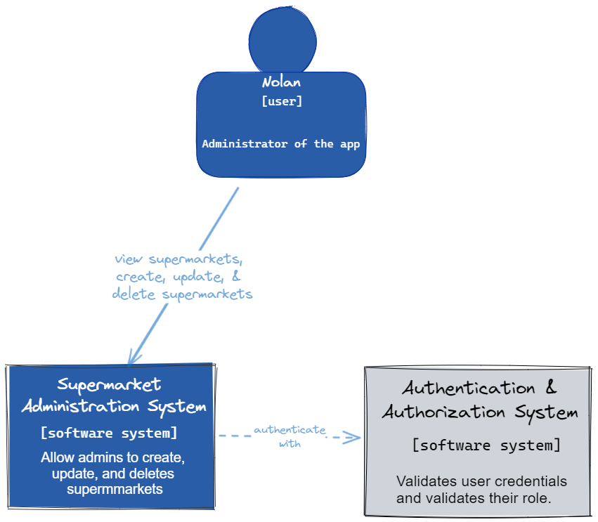
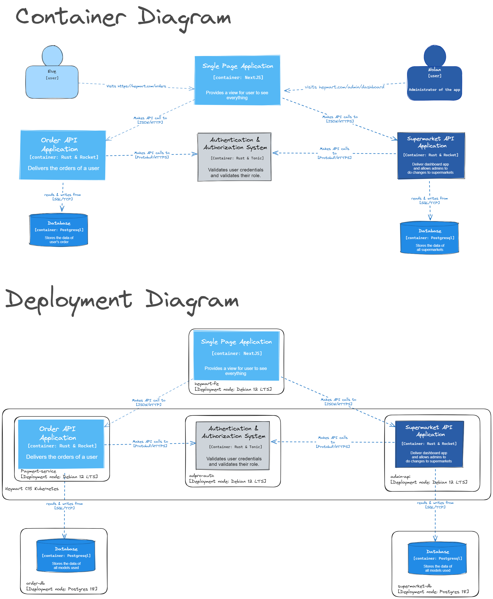
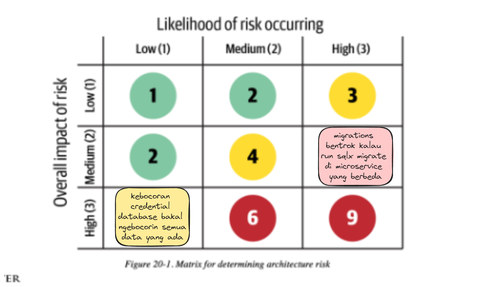

# C4 Model of The Current Architecture

Context Diagram

Container Diagram

Deployment Diagram

# Risk Storming
Hasil dikusi antara Juan Dharmananda Khusuma dan Maurice Yang dari kelompok C15

## Future Architecture

## Identification

Risk matrix

